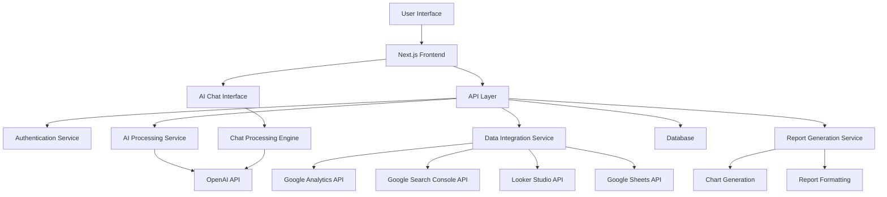
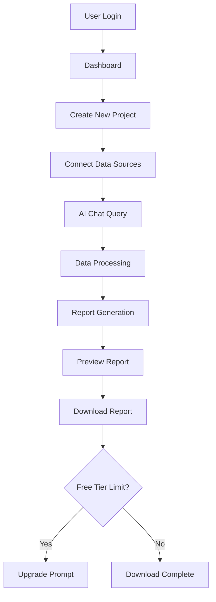

# LastMinuteReport - AI SaaS Reporting Platform Design

## 1. Overview

LastMinuteReport is an AI-powered SaaS platform designed for freelancers, agencies, and consultants to create professional monthly, quarterly reports for SEO, social growth, and website conversion metrics. The platform's unique selling proposition is its ability to generate reports using AI, pulling data from various sources including Google Analytics, Google Search Console, Looker Studio, and Google Sheets.

### Key Features
- AI-powered report generation
- Data integration from GA, GSC, Looker Studio, and Sheets
- Visually appealing charts and KPI displays
- Two main product offerings: Website SEO reporting and Paid Ads Reporting
- AI chatbot for data querying and report customization
- Report download functionality (first 3 projects free)
- Modern UI/UX with orange, black, white, and blue color scheme

## 2. Technology Stack

- **Frontend**: Next.js (React framework)
- **Styling**: Tailwind CSS or Styled Components
- **State Management**: Redux Toolkit or Context API
- **AI Integration**: OpenAI API or similar LLM service
- **Data Visualization**: Chart.js, D3.js, or Recharts
- **Authentication**: NextAuth.js or Auth0
- **Database**: PostgreSQL or MongoDB
- **Backend**: Next.js API Routes or separate Node.js service
- **Deployment**: Vercel or similar cloud platform

## 3. System Architecture

## 4. Core Components

### 4.1 Dashboard
- Navigation bar with Template, Account, About Platform, and Pricing sections
- Project listing view
- AI chat interface on the right side
- Quick access to report creation

### 4.2 Report Builder
- Template selection interface
- Data source connection management
- Drag-and-drop report components
- Real-time preview functionality

### 4.3 AI Chat Interface
- Natural language query input
- Intelligent question prompting for clarification
- Data visualization suggestions
- Report customization options

### 4.4 Data Integration Module
- Google Analytics connector
- Google Search Console connector
- Looker Studio connector
- Google Sheets connector
- Data validation and error handling

### 4.5 Report Generator
- Chart and visualization engine
- KPI dashboard components
- Export functionality (PDF, PPT, Excel)
- Free tier limitation (first 3 projects)

## 5. User Flow

## 6. Data Models

### 6.1 User Model
| Field | Type | Description |
|-------|------|-------------|
| id | UUID | Unique user identifier |
| email | String | User email address |
| password | String | Hashed password |
| name | String | User's full name |
| subscriptionTier | Enum | Free, Basic, Pro, Enterprise |
| createdAt | DateTime | Account creation timestamp |
| lastLoginAt | DateTime | Last login timestamp |

### 6.2 Project Model
| Field | Type | Description |
|-------|------|-------------|
| id | UUID | Unique project identifier |
| userId | UUID | Foreign key to User |
| name | String | Project name |
| type | Enum | SEO, Paid Ads |
| createdAt | DateTime | Project creation timestamp |
| lastModified | DateTime | Last modification timestamp |
| dataSources | JSON | Connected data sources |

### 6.3 Report Model
| Field | Type | Description |
|-------|------|-------------|
| id | UUID | Unique report identifier |
| projectId | UUID | Foreign key to Project |
| title | String | Report title |
| period | Enum | Monthly, Quarterly, Annual |
| content | JSON | Report content and structure |
| createdAt | DateTime | Report creation timestamp |
| generatedBy | Enum | AI, Manual |

### 6.4 Data Connection Model
| Field | Type | Description |
|-------|------|-------------|
| id | UUID | Unique connection identifier |
| userId | UUID | Foreign key to User |
| type | Enum | GA, GSC, Looker, Sheets |
| credentials | JSON | Encrypted connection credentials |
| isActive | Boolean | Connection status |
| lastSynced | DateTime | Last successful sync |

## 7. AI Chatbot Architecture

### 7.1 Natural Language Processing
- Intent recognition for data queries
- Entity extraction for metrics and time periods
- Context preservation across conversation

### 7.2 Clarification Engine
- Dynamic question generation based on query ambiguity
- Follow-up question suggestions
- Context-aware prompting

### 7.3 Data Retrieval & Processing
- API calls to connected data sources
- Data transformation and normalization
- Result aggregation and filtering

### 7.4 Visualization Mapping
- Chart type recommendation based on data
- Layout suggestions for KPI presentation
- Formatting options for different data types

## 8. Security & Compliance

- OAuth 2.0 for third-party data connections
- Encrypted storage of API credentials
- GDPR and CCPA compliance for data handling
- Role-based access control
- Audit logging for data access

## 9. Performance Considerations

- Caching of frequently accessed data
- Asynchronous report generation with progress indicators
- Pagination for large datasets
- CDN for static assets
- Database indexing for fast queries

## 10. Future Enhancements

- Collaboration features for teams
- Custom template creation
- Automated report scheduling
- Advanced analytics and forecasting
- Integration with additional data sources
- White-labeling options for agencies